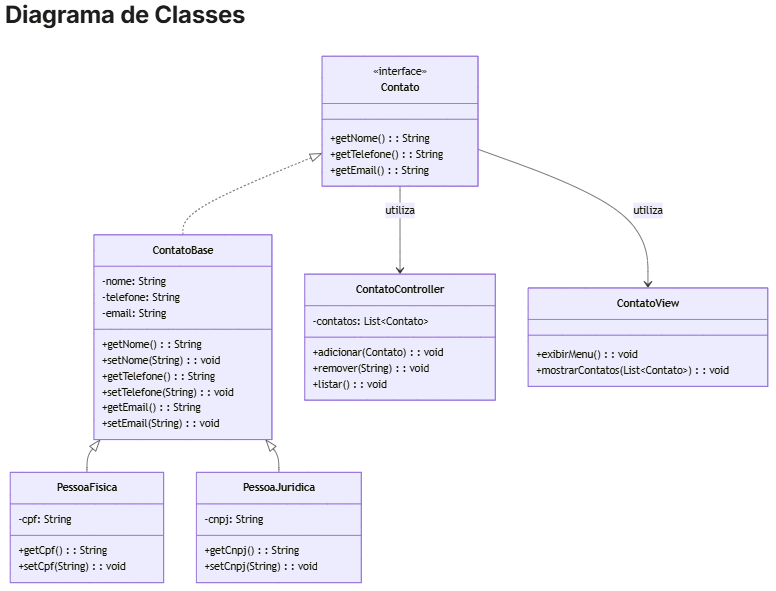

https://chaua.gitbook.io/programacao-orientada-a-objetos/05-trabalhos/estudo-dirigido-04

Estudo Dirigido 04

Instruções

Entrega via GitHub

Salvar os arquivos no diretório: ed04/

Todos os códigos devem estar documentados com Javadoc

Data limite de entrega: 11/05

Agenda de Contatos

Especificação do Sistema

A aplicação deve permitir:

Cadastro, listagem, atualização e exclusão de contatos.

Diferenciação entre tipos de contatos (Pessoa Física e Pessoa Jurídica).

Validação de dados básicos (nome obrigatório, CPF/CNPJ válidos, etc.).

Exibição das informações em formato tabular na interface textual.

Requisitos de Modelagem

Entidade (Model)

Interface Contato: define os métodos públicos obrigatórios.

Classe abstrata ContatoBase: contém atributos comuns como nome, telefone e email.

Classes concretas:

PessoaFisica: possui o atributo cpf.

PessoaJuridica: possui o atributo cnpj.

Apresentação (View)

Classe ContatoView: responsável pela entrada e exibição de dados no console.

Controle (Controller)

Classe ContatoController: orquestra a lógica da aplicação, manipulando a lista de contatos (armazenamento em memória).

Regras de Negócio

CPF deve conter 11 dígitos numéricos; CNPJ, 14.

O campo nome é obrigatório e deve conter no mínimo 3 caracteres.

Contatos devem ser únicos com base em CPF ou CNPJ.

Requisitos Técnicos

Encapsulamento: todos os atributos devem ser private, com métodos get e set conforme necessário.

Herança: uso de uma superclasse abstrata e implementação de interface.

Polimorfismo: uso de coleções do tipo Contato, com instâncias de PessoaFisica e PessoaJuridica.

Utilização de estruturas de dados como ArrayList.

Diagrama de Classes

(captura de tela)
